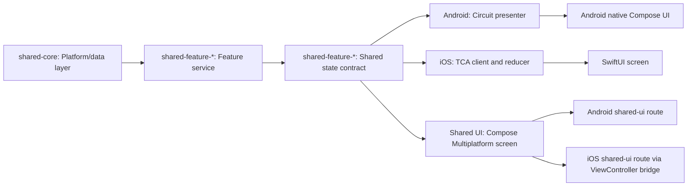
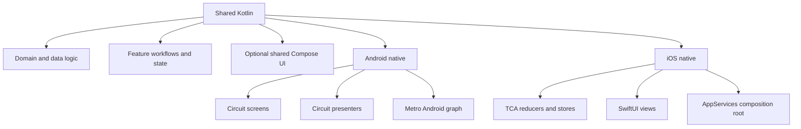
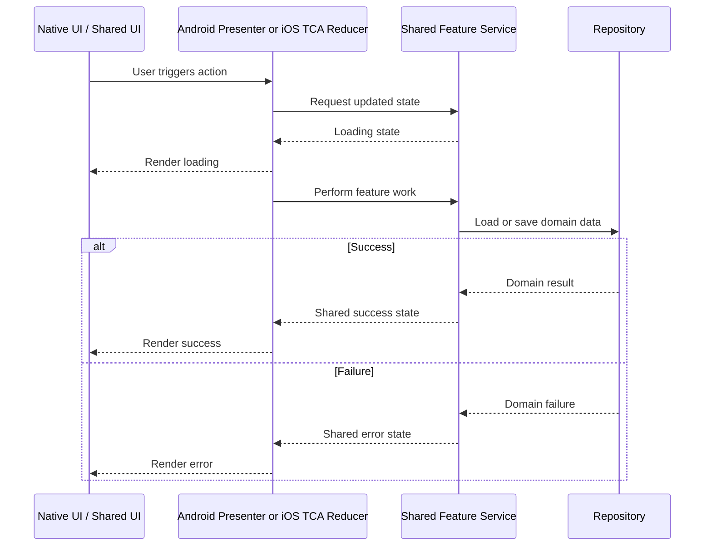

# How To Add A Feature

This repo follows a native-first shell with shared business logic pattern.
When adding a new feature, the goal is not to decide everything from scratch.
The goal is to repeat the same ownership boundaries that already work for the
`home` feature.

Use this document as the default blueprint unless the feature introduces a
materially new architectural concern.

## The rule

- Shared Kotlin owns domain, data, business rules, and feature state
  transitions.
- Android owns Android presentation through Circuit.
- iOS owns iOS presentation through TCA and SwiftUI.
- Shared Compose UI is optional and only added when it clearly reduces
  duplication.

If a new file makes you ask "is this behavior or presentation?", that usually
answers where it should live.

## Mental model

Use these diagrams as the fast architectural reference before following the
feature checklist.

### Feature flow

The important part is the middle seam: shared Kotlin owns the feature
workflow and typed state contract, then Android, iOS, and optional shared
Compose each adapt that contract in their own rendering layer.

### Ownership split

This is the intended split of responsibilities: shared Kotlin owns reusable
behavior, while each platform owns its native shell and its platform-specific
composition root.

### Sequence

This sequence is what we want to preserve as features grow: the native shell
reacts to user intent, shared Kotlin performs the business work, and the UI
renders typed state transitions instead of reproducing domain rules locally.

## Ownership map

Use this table when deciding where a new file should land.

| Concern | Own it here | Current reference |
| --- | --- | --- |
| Domain models, repository contracts, data access, API and persistence adapters | `shared-core/` | `CounterRepository.kt`, `PlatformContext.kt` |
| Shared feature rules, typed async state, feature orchestration | `shared-feature-*/` | `HomeFeatureState.kt`, `CounterLoadable.kt`, `HomeFeatureService.kt` |
| Shared Kotlin dependency graph and construction helpers | `shared-di/` | `SharedDependencies.kt` |
| Optional reusable shared Compose screen | `shared-ui-*/` | `HomeContent.kt` |
| Android presenter orchestration and Circuit contracts | `android-app/` | `HomePresenter.kt`, `HomeScreen.kt` |
| Android native Compose rendering and app navigation | `android-app/` | `HomeUi.kt`, `AppShell.kt` |
| Android platform composition root | `android-app/` | `AndroidAppGraph.kt` |
| iOS reducer, actions, effects, and state mapping | `ios-app/` | `HomeFeature.swift`, `HomeFeature+State.swift`, `HomeCounterLoadable.swift` |
| iOS native SwiftUI rendering and navigation | `ios-app/` | `HomeView.swift`, `RootView.swift` |
| iOS platform composition root and dependency injection bridge | `ios-app/` | `AppServices.swift`, `HomeFeatureClient.swift` |

## Suggested module shape

For a feature named `profile`, the default module shape should be:

- `shared-core/`
  Repository contracts, fake or real data sources, DTO mapping, persistence,
  and domain logic reused by multiple features.
- `shared-feature-profile/`
  Shared feature contract, typed state, events, service or use-case
  orchestration, and tests.
- `shared-ui-profile/`
  Optional shared Compose screen for the feature.
- `android-app/`
  Circuit screen, presenter, UI, Android graph wiring, and Android-specific
  tests.
- `ios-app/`
  TCA reducer, Swift-native state mapping, client adapter, SwiftUI views, and
  iOS-specific tests.

Not every feature needs `shared-ui-*`. Add it only when we actually want a
shared Compose path.

## Step-by-step

### 1. Start in shared core

Add shared data and domain seams in [`shared-core/`](../../shared-core).

Typical additions:

- repository interface
- fake implementation
- API client adapter
- persistence adapter
- domain model transformation

Good examples:

- [`CounterRepository.kt`](../../shared-core/src/CounterRepository.kt)
- [`PlatformContext.kt`](../../shared-core/src/PlatformContext.kt)

This layer should not know anything about Circuit, TCA, Compose screens, or
SwiftUI views.

### 2. Create the shared feature module

Add a new `shared-feature-*` module for the feature contract and behavior.

The default contents should be:

- feature state
- typed async state if needed
- events or actions if needed
- feature service or use-case facade
- tests for state transitions

The `home` feature is the reference shape:

- [`HomeFeatureState.kt`](../../shared-feature-home/src/HomeFeatureState.kt)
- [`CounterLoadable.kt`](../../shared-feature-home/src/CounterLoadable.kt)
- [`HomeFeatureService.kt`](../../shared-feature-home/src/HomeFeatureService.kt)

Use type-driven state for mutually exclusive async states. Prefer sealed types
over booleans like `isLoading` when the feature has distinct states such as
initial, loading, loaded, and error.

### 3. Wire shared DI

Register the feature's shared dependencies in
[`shared-di/`](../../shared-di).

That usually means:

- repository binding
- fake or real implementation choice
- feature service exposure
- test-friendly construction helpers

Reference:

- [`SharedDependencies.kt`](../../shared-di/src/SharedDependencies.kt)

The shared Metro graph is the Kotlin-side composition root. Tests should also
be able to construct the same feature wiring without ad hoc object assembly.

### 4. Add Android presentation

Implement the Android shell in [`android-app/`](../../android-app).

Follow the existing split:

- `FeatureScreen.kt`
- `FeaturePresenter.kt`
- `FeatureUi.kt`

And wire it into the Android graph:

- [`AndroidAppGraph.kt`](../../android-app/src/AndroidAppGraph.kt)

Android owns:

- Circuit screen contracts
- presenter orchestration
- navigation
- Android-only UI composition

Shared Kotlin should feed Android state, but should not expose Circuit types.

### 5. Add iOS presentation

Implement the iOS shell in [`ios-app/`](../../ios-app).

Follow the current TCA pattern:

- reducer
- actions
- state mapping
- shared client adapter
- SwiftUI screen and subviews

Reference files:

- [`HomeFeature.swift`](../../ios-app/src/Features/Home/HomeFeature.swift)
- [`HomeFeatureClient.swift`](../../ios-app/src/Features/Home/HomeFeatureClient.swift)
- [`HomeFeature+State.swift`](../../ios-app/src/Features/Home/HomeFeature+State.swift)

iOS owns:

- TCA reducer and effects
- Swift-native presentation state when needed
- navigation and platform-specific UI concerns
- SwiftUI views and composition

Shared Kotlin should feed feature behavior, but should not expose TCA types.

### 6. Decide whether shared Compose UI is worth it

Only add `shared-ui-*` when the feature benefits from a reusable shared screen.

Good reasons to add it:

- the screen is visually similar on both platforms
- it is useful as a shared demo or reference route
- we want to prove the shared feature contract can drive Compose
  Multiplatform UI too

Reference:

- [`HomeContent.kt`](../../shared-ui-home/src/HomeContent.kt)

If the feature is deeply platform-native, skip this module.

### 7. Add tests in three layers

Every feature should ideally have tests in these layers:

- shared Kotlin tests for repository and feature behavior
- Android presentation tests for presenter transitions
- iOS TCA reducer tests with `TestStore`

Reference tests:

- [`FakeCounterRepositoryTest.kt`](../../shared-core/test/FakeCounterRepositoryTest.kt)
- [`HomeFeatureServiceTest.kt`](../../shared-feature-home/test/HomeFeatureServiceTest.kt)
- [`HomePresenterStateProducerTest.kt`](../../android-app/test/home/HomePresenterStateProducerTest.kt)
- [`HomeFeatureTests.swift`](../../ios-app/tests/Features/Home/HomeFeatureTests.swift)

Current repo conventions:

- Kotlin tests use BDD-style names like `should have state X when Y`
- Kotlin tests should use explicit `given`, `when`, and `then` sections
- Swift tests use Swift Testing with `@Test`
- Tests needing object setup should use fixtures or factories instead of
  inlining noisy construction

### 8. Document only the delta

If the feature follows the established pattern, lightweight docs are enough.

If the feature changes the architecture, update:

- [`mobile-architecture.md`](./mobile-architecture.md)
- add a new ADR in [`docs/adr/`](../adr)

Do not create architecture churn in docs for a normal feature that simply
follows the blueprint.

## Golden path

This is the recommended order of work:

1. add repository or data seam in shared core
2. add feature service and typed state in shared feature
3. add shared tests for success, loading, and error
4. add Android Circuit shell
5. add iOS TCA shell
6. add optional shared Compose screen if it earns its place
7. update docs only if the architecture changed

## Smell checks

Before calling a feature "done", ask these questions:

- Can Android and iOS share the same business behavior without duplicating the
  rules?
- Are async states modeled as types instead of booleans?
- Does shared Kotlin avoid exposing Circuit or TCA types?
- Does Android own Android presentation concerns?
- Does iOS own iOS presentation concerns?
- If shared Compose exists, is it optional rather than mandatory for the app
  shell?
- Are tests present at shared and native presentation seams?

If the answer to most of these is "yes", the feature is probably landing in
the right places.

## When to break the pattern

It is reasonable to diverge from this blueprint when:

- the feature is purely platform-specific
- the UX differs substantially by platform
- the feature needs native-only integrations or system UI
- the feature is too small to justify a full shared feature module

Even then, prefer breaking the pattern consciously and documenting why, rather
than drifting accidentally.
